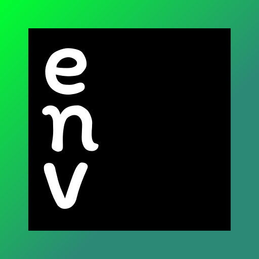

   
  

**Smart `.env` file manager for JetBrains IDEs**

 Syntax Highlighting &bull; Duplicate Detection &bull; Secret Leak Protection &bull; Cross-Environment Diff &bull; .envrc Support

 

<!-- Plugin description -->
EnvY brings first-class `.env` file support to all JetBrains IDEs. Syntax highlighting, duplicate key detection with inline warnings, secret leak protection, a cross-environment diff tool to spot mismatches between environments, and automatic secret folding in presentation mode.

## Free vs Pro

| Feature | Free | Pro |
|---|:----:|:---:|
| Syntax highlighting for `.env` files |  ✓   | ✓ |
| Duplicate key detection + quick-fix |  ✓   | ✓ |
| Cross-environment diff tool window |  ✓   | ✓ |
| Recursive `.env` file discovery |  ✓   | ✓ |
| `.envrc` (direnv) file support |  ✓   | ✓ |
| Secret values hidden in presentation mode |  ✓   | ✓ |
| Quick-fix: reveal hidden key / reveal all |  ✓   | ✓ |
| Env var autocomplete in code |  ✓   | ✓ |
| Secret leak detection |      | ✓ |
| Gitignore verification for secrets |      | ✓ |
| Quick-fix: add to `.gitignore` |      | ✓ |
| Quick-fix: replace secret with placeholder |      | ✓ |
| Sensitive key name detection |      | ✓ |
| Inline ghost completion (Tab to accept) |      | ✓ |

Works with IntelliJ IDEA, WebStorm, PyCharm, CLion, RustRover, GoLand, PhpStorm, and Rider.
<!-- Plugin description end -->

## Features

### Syntax Highlighting

Full syntax highlighting for `.env` files — keys, values, comments, quoted strings, and `export` prefixes are all visually distinct. Follows your IDE color scheme automatically.

**Supports any `.env.*` variant.**

### Duplicate Key Detection

Flags duplicate keys with inline warnings. When the same variable appears twice, only the last value takes effect — EnvY catches this before it causes issues in production.

### Cross-Environment Diff

A dedicated tool window for comparing environment files side by side. Select any two `.env` files and instantly see:

- **Missing variables** — keys that exist in one file but not the other
- **Value mismatches** — same key, different values across environments
- **Matching entries** — confirmation that configs are synced

### Secret Leak Protection (Pro)

Detects hardcoded secrets — AWS keys, Stripe keys, GitHub tokens, JWTs, and more — with regex pattern matching and key name heuristics. Warns when `.env` files containing secrets are not gitignored, with one-click quick-fixes to add them to `.gitignore` or replace values with placeholders.

### Presentation Mode

Secret values automatically fold to `***` when presentation mode is enabled. No configuration needed — EnvY detects sensitive keys and hides their values. Use the quick-fix gutter actions to reveal individual keys or all values at once.

### .envrc / direnv Support

Full support for `.envrc` files used by direnv. Environment variables defined with `export` are parsed and included automatically.

### Env Var Autocomplete 

Context-aware autocomplete for environment variable access patterns across 10+ languages — JavaScript, Python, Rust, PHP, Ruby, Go, Java, Kotlin, C#, and more. Includes **low-latency inline ghost completion** (Tab to accept) powered by an asynchronous caching engine.

## Installation

**From JetBrains Marketplace:**

`Settings` → `Plugins` → `Marketplace` → Search for **"EnvY"** → `Install`

## Roadmap

- [x] Secret leak detection (API keys, tokens, passwords)
- [x] Env var autocomplete in code
- [x] Recursive `.env` file discovery in subdirectories
- [x] `.envrc` (direnv) file support
- [x] Presentation mode secret folding
- [ ] Env dashboard (all vars across all files)

## License

Licensed under the [Apache License 2.0](LICENSE).
